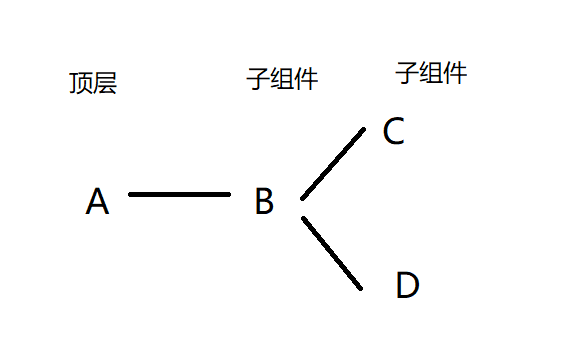
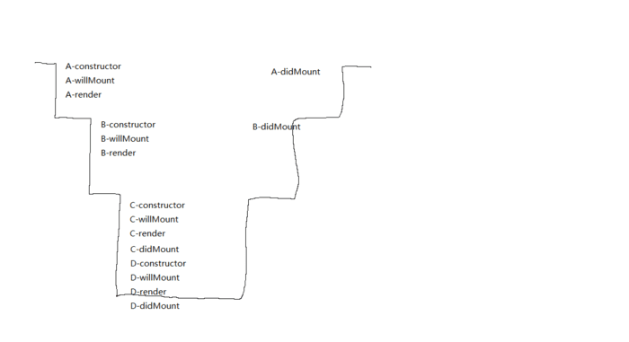

### React Fiber 架构理解

> 引用原文：[React Fiber Architecture](https://github.com/acdlite/react-fiber-architecture)
>
> React Fiber is an ongoing reimplementation of React's core algorithm. It is the culmination of over two years of research by the React team.
>
> The goal of React Fiber is to increase its suitability for areas like animation, layout,and gestures. Its headline feature is incremental rendering: the ability to split rendering work into chunks and spread it out over multiple frames.
>
> Other key features include the ability to pause, abort, or reuse work as new updates come in; the ability to assign priority to different types of updates; and new concurrency primitives.

React Fibre 是 React 核心算法正在进行的重新实现。它是 React 团队两年多的研究成果。

React Fiber 的目标是提高其对动画，布局和手势等领域的适用性。它的主体特征是增量渲染：能够将渲染工作分割成块，并将其分散到多个帧中。

其他主要功能包括在进行更新时暂停，中止或重新使用工作的能力，为不同类型的更新分配优先权的能力和新的并发原语。

### React16之前组件的渲染逻辑

**先来看一下react组件渲染时经历的生命周期：**

挂载阶段：
- `constructor()`
- `componentWillMount()`
- `render()`
- `componentDidMount()`

更新阶段：
- `componentWillReceiveProps()`
- `shouldComponentUpdate()`
- `componentWillUpdate()`
- `render()`
- `componentDidUpdate`

卸载阶段：
- `componentWillUnmount()`

**在之前的版本中，如果你实现一个很复杂的深度嵌套的复合组件，会出现下面的情况：**

现有层级关系如下的四个组件：



组件渲染时调用的生命周期顺序：
  
  

  上图展示的是A,B,C,D的挂载阶段调用的生命周期渲染顺序，可以看到从顶层组件开始调用各生命周期，一直向下，直至调用完最底层子组件的生命周期。然后再向上调用。
  组件更新阶段同理。
  
组件挂载之后，假如修改最上层组件的数据（state），组件更新时的调用栈：

  

  如果这是一个很大，层级很深的组件，可以想像到，组件在渲染时，调用栈过长，再加上如果在期间进行了各种复杂的操作，就可能导致长时间阻塞主线程，react渲染它需要几十甚至几百毫秒，这样的话react就会一直占用浏览器主线程，任何其他的操作（包括用户的点击，鼠标移动等操作）都无法执行，带来非常不好的用户体验。


### React Fiber的出现
React Fiber 就是为了解决上面的问题而生。
> 好似一个潜水员，当它一头扎进水里，就要往最底层一直游，直到找到最底层的组件，然后他再上岸。**在这期间，岸上发生的任何事，都不能对他进行干扰，如果有更重要的事情需要他去做（如用户操作），也必须得等他上岸。**
>
> Fiber 本质上是一个虚拟的堆栈帧，新的调度器会按照优先级自由调度这些帧，从而将之前的同步渲染改成了异步渲染，在不影响体验的情况下去分段计算更新。**它让潜水员会每隔一段时间就上岸，看是否有更重要的事情要做。**


对于如何区别优先级，React 有自己的一套逻辑。对于动画这种实时性很高的东西，也就是 16 ms 必须渲染一次保证不卡顿的情况下，React 会每 16 ms（以内） 暂停一下更新，返回来继续渲染动画。

对于异步渲染，现在渲染有两个阶段：`reconciliation` 和 `commit` 。前者过程是可以打断的，后者不能暂停，会一直更新界面直到完成。

下面是两个阶段涉及到的生命周期：

**Reconciliation** 阶段 （*React算法，用来比较2颗树，以确定哪些部分需要重新渲染*）

- `componentWillMount`
- `componentWillReceiveProps`
- `shouldComponentUpdate`
- `componentWillUpdate`

**Commit** 阶段 （*用于呈现React应用的数据更改。通常是`setState`的结果。最终导致重新渲染。*）

- `componentDidMount`
- `componentDidUpdate`
- `componentWillUnmount`

因为 `reconciliation` 阶段是可以被打断的，所以 `reconciliation` 阶段会执行的生命周期函数就可能会出现调用多次的情况，从而引起 Bug。所以对于 `reconciliation` 阶段调用的几个函数，除了 `shouldComponentUpdate` 以外，其他都应该避免去使用，并且 React16 中也引入了新的 API 来解决这个问题。

于是官方推出了`getDerivedStateFromProps`，让你在render设置新state，你主要返回一个新对象，它就主动帮你setState。由于这是一个静态方法，你不能取到 `this`，当然你也不能操作`instance`，这就阻止了你多次操作setState。这样一来，`getDerivedStateFromProps`的逻辑应该会很简单，这样就不会出错，不会出错，就不会打断DFS过程。

`getDerivedStateFromProps`取代了原来的`componentWillMount`与`componentWillReceiveProps`方法，该函数会在组件 初始化 和 更新 时被调用

```js
class ExampleComponent extends React.Component {
  // Initialize state in constructor,
  // Or with a property initializer.
  state = {};

  static getDerivedStateFromProps(nextProps, prevState) {
    if (prevState.someMirroredValue !== nextProps.someValue) {
      return {
        derivedData: computeDerivedState(nextProps),
        someMirroredValue: nextProps.someValue
      };
    }

    // Return null to indicate no change to state.
    return null;
  }
}
```
在进入commi阶段时，组件多了一个新钩子叫`getSnapshotBeforeUpdate`，它与commit阶段的钩子一样只执行一次。
`getSnapshotBeforeUpdate` 用于替换 `componentWillUpdate` ，该函数会在 `update` 后 DOM 更新前被调用，用于读取最新的 DOM 数据。

于是整个流程变成这样：（引用大神@司徒正美的图）


### React16 生命周期函数用法建议
结合 React Fiber 架构 建议如下使用react生命周期
```javascript
class ExampleComponent extends React.Component {
  // 用于初始化 state
  constructor() {}
  // 用于替换 `componentWillReceiveProps` ，该函数会在初始化和 `update` 时被调用
  // 因为该函数是静态函数，所以取不到 `this`
  // 如果需要对比 `prevProps` 需要单独在 `state` 中维护
  static getDerivedStateFromProps(nextProps, prevState) {}
  // 判断是否需要更新组件，多用于组件性能优化
  shouldComponentUpdate(nextProps, nextState) {}
  // 组件挂载后调用
  // 可以在该函数中进行请求或者订阅
  componentDidMount() {}
  // 用于获得最新的 DOM 数据
  getSnapshotBeforeUpdate() {}
  // 组件即将销毁
  // 可以在此处移除订阅，定时器等等
  componentWillUnmount() {}
  // 组件销毁后调用
  componentDidUnMount() {}
  // 组件更新后调用
  componentDidUpdate() {}
  // 渲染组件函数
  render() {}
  // 以下函数不建议使用
  UNSAFE_componentWillMount() {}
  UNSAFE_componentWillUpdate(nextProps, nextState) {}
  UNSAFE_componentWillReceiveProps(nextProps) {}
}
```